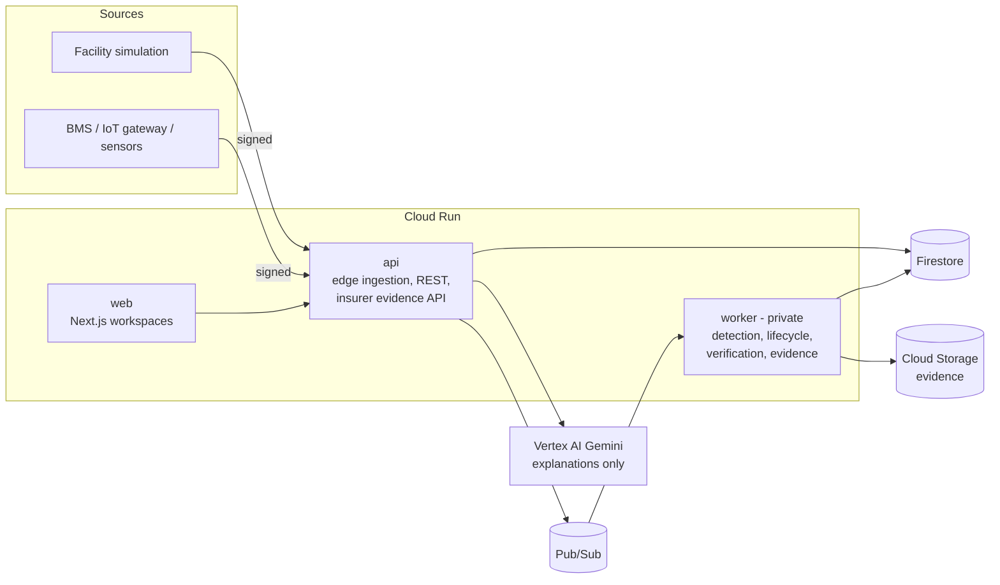

# Symbiosis AI

**Sensor-verified risk improvement for property insurers and the businesses they insure.**

> AI explains. People act. Sensors verify. Evidence proves. The customer controls what the insurer sees.

Symbiosis is a vendor-neutral, human-in-the-loop platform that turns physical risk signals and human
mitigation actions into **auditable, sensor-verified evidence of risk improvement**, which the insured
organization can choose to share with its insurer.

## Contents

- [The problem](#the-problem)
- [The solution](#the-solution)
- [How it works](#how-it-works)
- [Architecture](#architecture)
- [What makes it different](#what-makes-it-different)
- [Benefits](#benefits)
- [Key capabilities](#key-capabilities)
- [Try it locally](#try-it-locally)
- [Testing](#testing)
- [Deployment](#deployment)
- [Repository layout](#repository-layout)
- [Trust, security and limits](#trust-security-and-limits)
- [Documentation](#documentation)

## The problem

Sensors can already detect leaks, freezing, overheating and failing equipment, and send an alert. The
weak link is what happens **after** a risk is identified:

- Who owns the recommendation?
- Was the action actually completed?
- Did the action reduce the physical risk, or only get ticked off?
- Did the improvement last, or did the hazard return?
- What trustworthy evidence can be shared with the insurer, without handing over a firehose of raw data?

Today, the answers live in emails, spreadsheets and self-reported checklists. A "completed" ticket is
not proof the risk went down, insurers cannot tell reported work from effective work, and businesses
have no safe way to show real improvement without exposing operational data.

## The solution

Symbiosis closes the loop. The central object is not an alert but a persistent **Risk Improvement
Case** that follows one hazard from detection to proven improvement, and back if it returns:

```
detect -> alert -> acknowledge -> assign -> act -> verify with sensors -> evidence -> consent -> monitor -> reopen if it returns
```

- **Detect** persistent, compound deterioration with a deterministic, versioned rule.
- **Assign** accountable humans and approved actions. Escalate when nobody responds.
- **Verify** the physical outcome from trusted post-action sensor readings, never from a self-report.
- **Prove** it with an immutable, hashed evidence package, whatever the result.
- **Share** only what the customer consents to, revocably and with a full audit trail.
- **Watch** for recurrence and reopen the _same_ case when the hazard returns.

## How it works

The reference scenario is a cold-storage facility whose cooling plant is degrading.

1. **Telemetry arrives** (vibration, current, zone temperature, equipment state, outdoor weather) as
   signed requests, mapped by a versioned adapter into a canonical observation.
2. **Quality and trust checks** rate each reading. Stale, out-of-range or unauthenticated data is
   excluded or down-weighted, never silently trusted.
3. **Detection** finds a persistent compound condition, for example vibration and current above their
   learned baselines while the zone warms. One abnormal signal alone is only a watch condition.
4. **A case opens and the facility manager is alerted.** They acknowledge, assign and report an
   approved action. The case then shows **VERIFICATION PENDING**. A reported action is never shown as
   an improvement.
5. **Deterministic verification** runs after the post-action window and concludes
   `VERIFIED_IMPROVED`, `PARTIALLY_VERIFIED`, `NOT_IMPROVING` or `INCONCLUSIVE`, with confidence and
   reason codes. If the fix did not work, a follow-up goes out.
6. **An evidence package** is built and hashed. The facility can grant its insurer scoped, revocable
   access to the parts it chooses.
7. **Monitoring continues.** If the same hazard returns inside the watch window, the same case reopens.

## Architecture



Principles that shape the design:

| Principle                                  | What it means in the code                                                          |
| ------------------------------------------ | ---------------------------------------------------------------------------------- |
| AI advises, code decides, people act       | No LLM in detection, verification, lifecycle, consent or intervention selection    |
| Reported is not verified                   | Only trusted sensor data can produce a verified state                              |
| Vendor-neutral                             | Risk logic uses canonical signals; vendors integrate through declarative adapters  |
| Consent first                              | Raw telemetry stays with the insured; insurers see consented, audited evidence     |
| Versioned policy                           | Every threshold lives in `config/`; every result records the policy version        |
| Honest provenance                          | Simulation data, live weather, deterministic results and AI text are labelled apart |

Read the full design, the case state machine, the event pipeline and the security model in
[docs/ARCHITECTURE.md](docs/ARCHITECTURE.md).

## What makes it different

Alerting is not new. Symbiosis is built around the part that usually has no owner:

- **Verification of effect, not just of activity.** A deterministic policy compares trusted
  post-action readings with the case's own baseline. Missing, stale or low-quality data can only ever
  produce `INCONCLUSIVE`, never a false pass.
- **A case, not an alert.** One durable record carries the hazard, the people, the actions, the
  verification, the evidence and any recurrence, and it can be **reopened** when a verified fix decays.
- **Consent-controlled evidence.** Insurers receive evidence packages, not dashboards. The customer
  grants and revokes scopes; every read is audited; raw telemetry is separately opt-in.
- **Bounded AI.** Gemini only restates facts the system already established. Each answer is validated
  against those facts and discarded for a deterministic template if any check fails. It cannot decide,
  create evidence or change state.
- **Integrate anything.** Building systems and gateways connect through versioned, declarative source
  mappings (no scripting) into one canonical observation contract. No proprietary sensor is required.
- **Provable behaviour.** Architectural tests, 15 mutation checks and a real-time cloud smoke test
  guard the boundaries that matter, for example that the simulator can never touch cases or evidence.

## Benefits

| For                     | Benefit                                                                                              |
| ----------------------- | ---------------------------------------------------------------------------------------------------- |
| Facility managers       | Clear next action, an accountable owner, and proof their work reduced the risk                      |
| Insured organizations   | Show real improvement to insurers while keeping control of their operational data                    |
| Risk engineers          | See which recommendations are open, reported only, or independently verified, and which regressed  |
| Underwriters            | Concise, consented, risk-quality evidence instead of a sensor dashboard                              |
| Security and compliance | Tenant isolation, signed devices, immutable evidence, audit trail, documented AI limits              |

## Key capabilities

- **Facility workspace**: case list and detail ("what happened, why it matters, what to do, who owns it,
  what was done, did it work, is it staying fixed"), evidence, sharing and a timeline.
- **Insurer workspace**: consented outcomes, recurrence, recommendations and evidence metadata only;
  "Not shared with you" for any scope the customer did not grant.
- **Facility Simulation** (`/operations/simulation`): a synthetic cold-storage plant with a sensor
  diagram, scenarios (normal, emerging deterioration, compound risk, ineffective mitigation,
  successful mitigation, sensor failure, recurrence), manual controls, live or simulated weather, the
  rule's own conclusion, the case and its notifications, verification charts, evidence, an
  **Integration Lab** (source payload to mapping to canonical observation) and an editable, versioned
  **demo policy**.
- **Decision support**: a deterministic risk-engineer recommendation (Remote Monitoring, Remote Review,
  Risk Engineer Review, Site Visit Recommended) that schedules nobody and changes no underwriting.
- **Trust Center** page explaining how conclusions are reached and what is not claimed.

## Try it locally

Requires Node 20 or newer and pnpm 12.

```
pnpm install
pnpm dev
```

`pnpm dev` starts the API and worker (one process, in-memory event bus) on `http://127.0.0.1:8787`, a
signed telemetry simulator, and the web app on `http://127.0.0.1:3000`. Open the web app, pick a demo
identity (a development identity, not real authentication), and explore the facility and insurer
workspaces. Choose what the simulator sends with `SIMULATOR_SCENARIO` (for example
`SIMULATOR_SCENARIO=compound-outdoor-heat pnpm dev`). Baseline learning needs a short warm-up in real
time; the smoke tests below use a simulated clock instead.

## Testing

```
pnpm lint && pnpm typecheck && pnpm format:check
pnpm test                 # unit, integration and Firestore-emulator contract tests (needs Java)
pnpm test:e2e             # builds the web app, then Playwright browser tests incl. accessibility (axe)
pnpm check:simulation-boundaries   # mutation checks of the simulation boundaries (needs a clean tree)
```

End-to-end smoke runs over real HTTP, each self-checking:

| Command             | What it proves                                                                 |
| ------------------- | ------------------------------------------------------------------------------ |
| `pnpm smoke:ingestion`     | Signed ingestion, replay protection, normalization                             |
| `pnpm smoke:detection`     | Baselines, isolated anomalies, compound deterioration opens one case           |
| `pnpm smoke:workflow`     | Alert, acknowledge, assign, report, verification pending                       |
| `pnpm smoke:verification`     | Trusted post-action data verifies; a returning hazard reopens the same case    |
| `pnpm smoke:evidence`     | Evidence package and hashes, consent, insurer read, revocation                 |
| `pnpm smoke:ui`     | Both personas driven in a real browser, including phone width                  |
| `pnpm smoke:explanations`     | Grounded explanations, consent, fallback                                       |
| `pnpm smoke:simulation` | Full closed loop through the facility simulation                               |

Opt-in checks against a real cloud project (they write synthetic records to its simulation facility):
`pnpm smoke:cloud` and `pnpm smoke:cloud-simulation` (real time, live weather). Both require
`--confirm-project <id>` and an environment flag, and never print credentials.

## Deployment

Three Cloud Run services (`web`, `api`, private `worker`) with dedicated least-privilege service
accounts, on Firestore, Pub/Sub, Cloud Storage, Secret Manager, Firebase Authentication, Vertex AI and
Cloud Scheduler. Cloud sign-in uses Firebase Email/Password; the API verifies each ID token and derives
organization, facilities and roles from stored records, never from the request. Resource map, IAM
matrix, Firestore structure, deployment and rollback are in [docs/GCP_RUNTIME.md](docs/GCP_RUNTIME.md).

```
pnpm seed:gcp --confirm-project <id>      # idempotent synthetic demo organizations and users (operator only)
pnpm seed:sim --confirm-project <id>      # simulation facility devices and keys (operator only)
pnpm provision:device --confirm-project <id> --device-id <id> --asset <id> --signals <list>
```

Demo-user passwords are written only to a git-ignored local file. Email notifications use a console
provider until SMTP credentials are added to Secret Manager.

## Repository layout

```
apps/            web (Next.js), api, worker, simulator
packages/        domain modules: contracts, detection, verification, evidence, consent, ...
adapters/        GCP, weather, email and simulator implementations of the ports
config/          versioned policies: rules, verification, escalation, actions, source adapters
infrastructure/  Cloud Build, deploy and IAM scripts, Firestore rules
tests/           unit, integration, contract, security and browser tests
scripts/         dev launcher, smoke runs, seeding, provisioning, mutation checks
docs/            architecture, decisions, adapters, evidence standard, AI governance, runbook
```

## Trust, security and limits

- Devices sign every request (HMAC-SHA256 over method, path, timestamp, nonce, sequence and body hash);
  replays are rejected. Keys live in Secret Manager.
- Tenants are isolated by scoped ids and server-side identity mapping. Firestore client access is
  denied; only the services read and write.
- Evidence packages are immutable, hashed and written once.
- Every insurer read is consent-checked and audited.
- Secrets are never committed. `.env.example` lists placeholder **names** only.

What Symbiosis deliberately does **not** do: claim an alert prevented a loss, change premiums,
underwrite or adjudicate, command building equipment, call a self-report "verified", expose raw
telemetry to insurers by default, or let an LLM decide whether a risk was fixed.

Current limits: no real vendor integration yet (the shipped source profiles are clearly labelled
synthetic); the simulation runs in real time with a shortened demo policy; real email delivery awaits
SMTP credentials; one worker instance. Details are in [docs/SESSION_HANDOFF.md](docs/SESSION_HANDOFF.md).

## Documentation

| Document                                           | Contents                                                |
| -------------------------------------------------- | ------------------------------------------------------- |
| [docs/ARCHITECTURE.md](docs/ARCHITECTURE.md)       | Design, state machine, pipeline, security model         |
| [docs/ADAPTERS.md](docs/ADAPTERS.md)               | Vendor-neutral source adapters and integration path     |
| [docs/EVIDENCE_STANDARD.md](docs/EVIDENCE_STANDARD.md) | Evidence package format, hashing, consent scopes    |
| [docs/AI_GOVERNANCE.md](docs/AI_GOVERNANCE.md)     | What the AI may and may not do, and how it is checked   |
| [docs/GCP_RUNTIME.md](docs/GCP_RUNTIME.md)         | Cloud resources, IAM, deployment, rollback, operations  |
| [docs/DECISIONS.md](docs/DECISIONS.md)             | Decision log                                            |

Everything in this repository is synthetic and for demonstration. No real customer, device or vendor
data is included.
