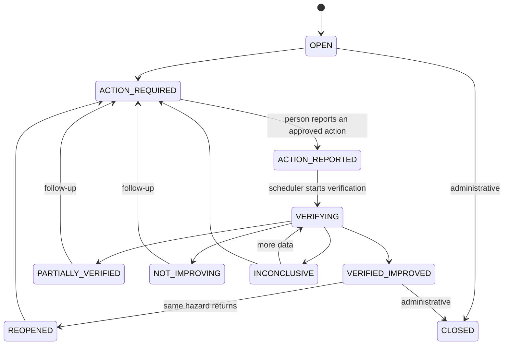
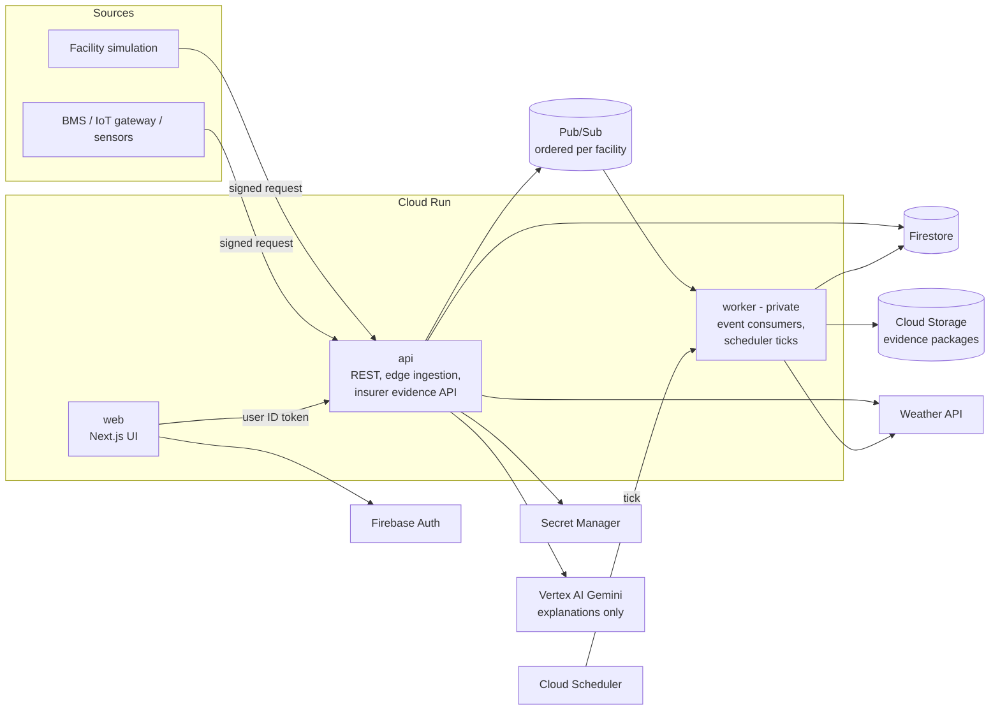
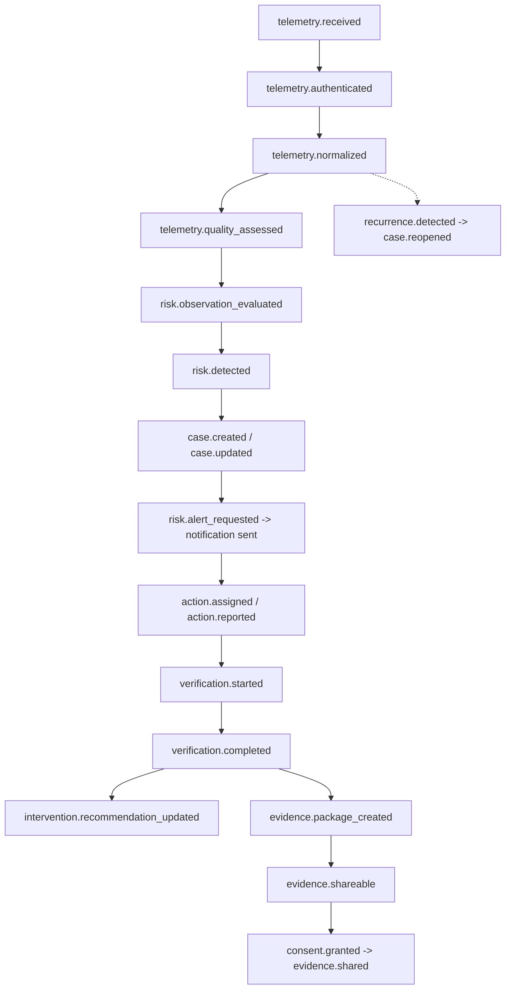

# Architecture

This document describes how Symbiosis is built and why. For operating the deployed system see
[GCP_RUNTIME.md](GCP_RUNTIME.md); for the decision history see [DECISIONS.md](DECISIONS.md).

## Design principles

1. **AI advises; deterministic code decides state; humans act; sensors verify.**
2. A human action report is evidence of _action_, never evidence of _effectiveness_.
3. Missing, stale, unauthenticated or low-quality telemetry can never produce `VERIFIED_IMPROVED`.
4. Raw telemetry belongs to the operational side. Insurer access is evidence-oriented, consent-scoped,
   revocable and audited.
5. No cloud-to-equipment control. Symbiosis recommends; people act.
6. Risk logic uses canonical signals, never vendor or hardware model names. Thresholds live in versioned
   files under `config/`.
7. Every important transition records the policy version and the evidence ids behind it.
8. Synthetic data is labelled as synthetic at the API and UI level.
9. No failure silently becomes success. The system stays useful when the AI model is unavailable.
10. Every external integration sits behind an adapter or port.

## The core object: the Risk Improvement Case

The durable record is not an alert. It is a **Risk Improvement Case** that links a hazard, trusted
observations, a risk event, accountable human action, post-action verification, an evidence package,
consented sharing and continued monitoring. Alerts are communications generated _by_ a case.

A verified state is reachable **only** from `VERIFYING` with a valid verification assessment. `CLOSED` is
administrative and never implies verification. Only a `VERIFIED_IMPROVED` case can be reopened by
recurrence. The transition table is `CASE_TRANSITIONS` in `packages/risk-cases`.

## System overview

Three deployables carry the system: `web` (Next.js), `api` and `worker`. A fourth process, `simulator`,
emits signed synthetic telemetry through the exact edge contract. Logical capabilities are separate
packages inside the monorepo, not separate microservices. Locally the same code runs in a single process
with in-memory adapters (`pnpm dev`); in the cloud `SYMBIOSIS_RUNTIME=gcp` selects Firestore, Pub/Sub,
Cloud Storage, Secret Manager, Firebase Auth and Vertex AI, and refuses to start rather than fall back to
memory.

## The event pipeline

Every event carries `event_id`, `event_type`, `schema_version`, `correlation_id`, `causation_id`,
`organization_id`, `facility_id`, `occurred_at` and `producer`. Delivery is at least once. The worker
records each processed event, drops redelivered ones and acknowledges only after every handler
succeeded. Events of one facility are delivered in order (Pub/Sub ordering key
`<organizationId>:<facilityId>`), because detection pairs readings taken at the same instant. Failures
retry with backoff and dead-letter after five attempts.

## Stages in detail

**Ingestion and trust.** Devices and gateways call `POST /edge/v1/telemetry`, `/edge/v1/heartbeat` or
`/edge/v1/source`. Each request is signed with `HMAC-SHA256(device key, method, path, timestamp, nonce,
sequence, SHA-256(raw body))`; the nonce and sequence are checked atomically for replay. The device record
(never the request) decides which source profile applies. Keys live in Secret Manager.

**Source adapters.** A building system integrates through a declarative, versioned `source-mapping.v1`
file: payload paths, units, bounds, enums and asset maps, with no scripting. The result is a canonical
observation (signal, canonical unit, asset, `observedAt`). See [ADAPTERS.md](ADAPTERS.md).

**Data quality.** Each observation is assessed for freshness, bounds, plausibility and device trust;
failures lower confidence or exclude the reading and are never silently ignored.

**Baselines.** Learned per asset, signal and operating mode over a configurable warm-up window.
Re-baselining is an audited action.

**Detection.** A deterministic, versioned rule (`config/rules/`) looks for persistent compound
deterioration, for example vibration above its learned baseline _and_ current above baseline _and_ a
rising zone temperature or extreme outdoor heat, persisting for a configured number of checks. A single
abnormal signal produces at most a watch condition.

**Workflow.** A case notifies the configured roles, escalates on deadlines (`config/escalation/`), and
accepts only approved, recommend-only actions from `config/action-library/`. A person acknowledges,
assigns and reports. Reporting moves the case to verification pending, nothing more.

**Verification.** After the post-action window, a deterministic policy
(`config/verification-policy/`) compares trusted post-action readings with the case's baseline
snapshot: required criteria (vibration, current, backup capacity where relevant), supporting criteria
(zone temperature), minimum observations, acceptable missingness, sustained duration, hysteresis and
device integrity. The result is `VERIFIED_IMPROVED`, `PARTIALLY_VERIFIED`, `NOT_IMPROVING` or
`INCONCLUSIVE`, with confidence and reason codes; history is kept.

**Recurrence.** After a verified improvement the case enters a recurrence watch. If the same hazard
returns inside the window, the **same case** is reopened and the count increases.

**Intervention recommendation.** A deterministic, versioned prioritization
(`config/intervention-policy/`) recalculated on material events recommends _Remote Monitoring_,
_Remote Review_, _Risk Engineer Review_ or _Site Visit Recommended_. It is decision support only: it
schedules nobody and changes no underwriting, premium or coverage.

**Evidence.** Every completed verification, whatever its result, produces an immutable evidence
package: canonical JSON, a SHA-256 manifest, frozen device and policy facts, an explicit data-origin
label. It is written once to Cloud Storage and read back for a hash check. A package for a
`NOT_IMPROVING` result says so. Format: [EVIDENCE_STANDARD.md](EVIDENCE_STANDARD.md).

**Consent.** The insured creates sharing agreements naming the recipient organization, facilities and
scopes (`RECOMMENDATION`, `EVENT_SUMMARY`, `ACTION_SUMMARY`, `BEFORE_AFTER_METRICS`,
`VERIFICATION_RESULT`, `VERIFICATION_CONFIDENCE`, `RECURRENCE_STATUS`, `EVIDENCE_ARTIFACTS`,
`INTERVENTION_RECOMMENDATION`; `RAW_TELEMETRY` is separate and off by default). Every insurer read goes
through the consent gateway and is audited. A revoked, expired or out-of-scope agreement is denied on the
very next request.

**AI explanations.** Gemini (through an `ExplanationProvider` port) restates facts the deterministic
system already established. Each answer is validated against those facts (schema, ids, numbers, result
and level fidelity, approved actions, prohibited claims); one failed check discards it in favour of a
deterministic template. The explanation path has no write access. See [AI_GOVERNANCE.md](AI_GOVERNANCE.md).

## Facility simulation

The simulation package produces **source data only**: sensor and equipment state. It has no code path to
cases, verification, evidence or recurrence (an architectural test enforces this). Its vendor payloads are
signed and sent through the same edge boundary and adapters as any gateway, so the whole pipeline is
exercised for real. Time is real time with a shortened, versioned demo policy; weather is live
(`LIVE WEATHER`), explicitly simulated (`SIMULATED WEATHER`) or `WEATHER UNAVAILABLE`, never faked.

## Repository map

| Path          | Contents                                                                                  |
| ------------- | ----------------------------------------------------------------------------------------- |
| `apps/web`    | Next.js 16 / React 19 UI: facility workspace, insurer workspace, trust page, simulation   |
| `apps/api`    | Application API, edge ingestion, insurer evidence API                                      |
| `apps/worker` | Event consumers and scheduler pass: detection, lifecycle, verification, evidence          |
| `apps/simulator` | Signed synthetic telemetry generator                                                   |
| `packages/*`  | Domain modules (see below), each with its own tests                                        |
| `adapters/*`  | Ports implemented for GCP, weather, email and the simulator                                |
| `config/`     | Versioned JSON policies: rules, verification, escalation, actions, interventions, adapters |
| `infrastructure/` | Cloud Build, deploy and IAM scripts, Firestore rules                                   |
| `tests/`      | Unit, integration, contract (Firestore emulator), security and browser tests               |
| `scripts/`    | Dev launcher, smoke runs, seeding, provisioning, mutation checks                           |

Domain packages: `contracts` (shared vocabulary), `authz`, `tenancy`, `device-registry`,
`edge-security`, `normalization`, `data-quality`, `baselines`, `risk-detection`, `recommendations`,
`risk-cases`, `risk-lifecycle`, `action-orchestration`, `escalation`, `intervention-prioritization`,
`verification`, `recurrence`, `evidence`, `consent`, `audit`, `notifications`, `ai-explanation`,
`simulation`, `repositories`, `runtime`, `event-bus`, `clock`. `loss-model` and `portfolio` are
reserved, empty packages for future work.

## Security model

| Threat                                | Mitigation                                                                                           |
| ------------------------------------- | ---------------------------------------------------------------------------------------------------- |
| Spoofed or tampered telemetry         | HMAC over method, path, timestamp, nonce, sequence and body hash; TLS in the cloud                   |
| Replay, stale packets                 | Atomic nonce and sequence check; timestamp window                                                    |
| Stolen device key                     | Per-device keys in Secret Manager, key id in every request, rotation supported                        |
| Cross-tenant access                   | Tenant-scoped record ids, server-side identity mapping, Firestore rules deny all client access      |
| Compromised or forged identity        | Firebase ID tokens verified (signature, issuer, audience, expiry, revocation); roles come from stored records, never from the request |
| Consent bypass                        | Single consent gateway for every insurer read; deny by default; audited; revocation effective next request |
| False completion reports              | A reported action never verifies; only trusted sensor data can                                       |
| Fabricated or manipulated AI output   | Facts-only prompts, schema and fact validation, deterministic fallback, no write access              |
| Evidence tampering                    | Immutable packages, SHA-256 manifests, write-once object storage, hash re-check                      |
| Cloud or AI outage                    | Deterministic template fallback; idempotent redelivery and scheduler repair                          |
| Recurrence after closure              | Recurrence watch reopens the same case                                                               |

Runtime identities hold least-privilege roles (no Owner or Editor); the worker is private and reachable
only with Pub/Sub or Scheduler identity. Residual risks and known limitations are listed in
[SESSION_HANDOFF.md](SESSION_HANDOFF.md) and [GCP_RUNTIME.md](GCP_RUNTIME.md).

## What Symbiosis does not do

It does not claim an alert prevented a loss, change premiums, underwrite, bind, cancel or adjudicate
claims, command building equipment, claim actuarial validation, call a user report "verified", expose raw
telemetry to insurers by default, or use an LLM to decide whether a physical risk was fixed. No real
vendor integration exists yet; the shipped source profiles are synthetic.
